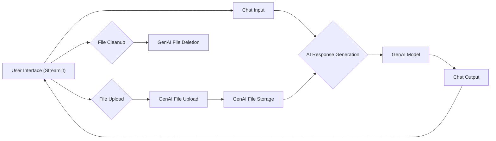

## NPTEL Assignment Assistant

This repository contains the code for a Streamlit web application designed to assist users with their NPTEL assignments using Google's Generative AI (GenAI). The application allows users to upload PDF files, ask questions about the content, and receive answers from the AI model, potentially including citations from the uploaded documents.

### Features

* **PDF Upload:** Users can upload PDF files related to their NPTEL assignments.
* **Interactive Chat:** Engage in a conversational chat interface to ask questions about the uploaded content.
* **AI-Powered Responses:** Get accurate and insightful answers from the GenAI model, powered by Google's latest language models.
* **Citation Integration:** The AI model can provide relevant citations from the uploaded PDF files, supporting its answers with evidence.

### Technologies

* **Streamlit:** Used to create the user-friendly web application interface.
* **Google Generative AI:** Provides the AI model and file storage services.
* **Python:** The primary programming language for the application.
* **Other Libraries:** `protobuf`, `tempfile`, `time`, `os` are used for specific tasks.

### Architecture Overview



The application's architecture is centered around a Streamlit UI that handles user interactions and manages file uploads and chat sessions. The GenAI API is used for file storage and AI response generation. Session state is used to maintain user context, including uploaded files and chat history.

### Development Environment Setup

1. **Install Python:** Ensure you have Python 3.7 or higher installed on your system.
2. **Create Virtual Environment:** 
   ```bash
   python -m venv venv-test
   source venv-test/bin/activate
   ```
3. **Install Dependencies:**
   ```bash
   pip install -r requirements.txt
   ```
4. **Set up Google Cloud API Key:**
   * Obtain your Google Cloud Platform API key and store it as an environment variable:
     ```bash
     export GOOGLE_APPLICATION_CREDENTIALS="/path/to/your/key.json"
     ```
5. **Run the Application:**
   ```bash
   streamlit run app.py
   ```

### Testing

No automated tests are currently included. You can manually test the application by uploading PDF files, asking questions, and reviewing the AI-generated responses.

### Deployment

The application can be deployed to a Streamlit cloud server or other suitable platforms.

### Performance Considerations

For optimal performance, consider optimizing file uploads and AI response generation. Consider using caching mechanisms to reduce redundant requests to GenAI services.

### Security Considerations

* **API Key Protection:** Securely store your Google Cloud API key and avoid exposing it in public repositories.
* **Data Privacy:** Ensure that user-uploaded files and chat history are handled securely and in accordance with privacy regulations.
* **Input Validation:** Implement appropriate input validation to prevent potential vulnerabilities caused by malicious user input.

### Future Improvements

* **Advanced Chat Features:** Implement features like multi-turn conversations, context awareness, and user history tracking.
* **Advanced File Handling:** Allow users to upload multiple files, manage file organization, and control file deletion.
* **Advanced AI Capabilities:** Explore other GenAI models and features for improved accuracy and insights.

### Contribution Guidelines

Contributions are welcome! Please create a pull request with a detailed description of your changes.

### License

MIT LICENSE

### Acknowledgements

This project is built upon the work of Google Generative AI and the Streamlit framework. We acknowledge their contributions and the valuable resources they provide.

### Contact

[Insert contact information here] 
